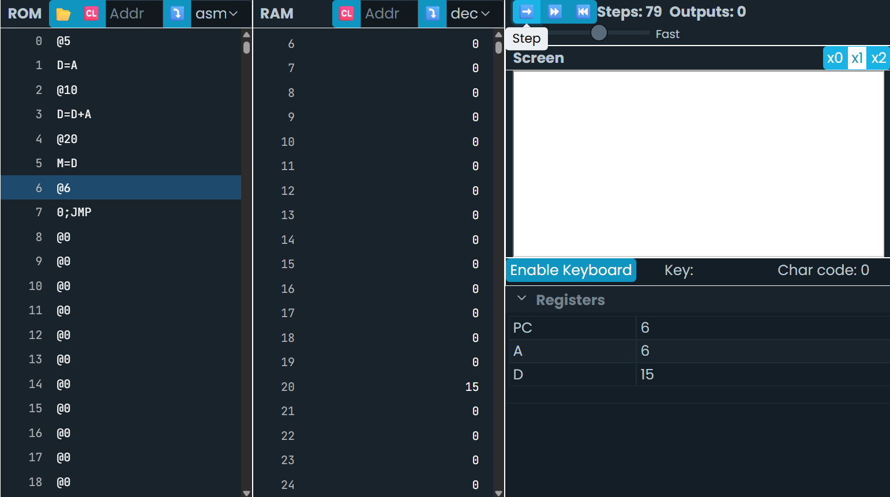
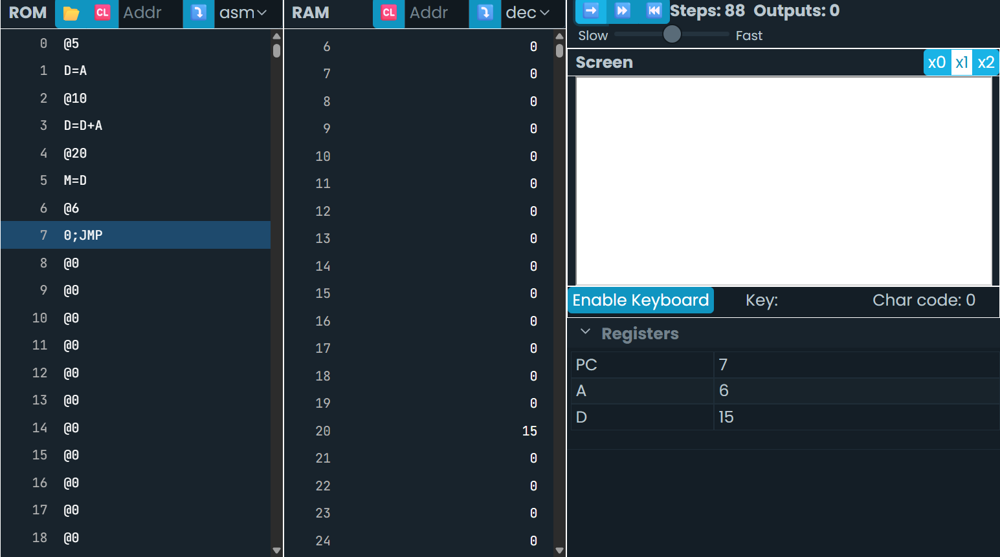

Ahora es tu turno. Crea un archivo llamado program.asm y copia el código del programa anterior. Ejecuta el programa en el simulador de la CPU Hack y observa cómo se comporta. ¿Qué sucede? ¿Qué valor se almacena en la dirección de memoria 16? ¿Por qué crees que es ese valor? ¿Qué instrucciones se ejecutan en cada ciclo Fetch-Decode-Execute? ¿Qué cambios observas en el contenido de la memoria y los registros?
```asm
@1
D=A
@2
D=D+A
@16
M=D
(END)
@END
0;JMP
```


El programa realiza una funcion de suma dando como resultado el numero 3. Al momento de definir "@16" y "M=D" lo que hacemos es que a la posicion 16 de la ram le asignamos el numero 3 y la el "@6" y la etiqueta 0;JUMP cumple la funcion de bucle infinito.

Escribe un programa en lenguaje ensablador que sume los números 5 y 10, y almacene el resultado en la dirección de memoria 20. Utiliza el simulador de la CPU Hack para ejecutar tu programa y verifica que el resultado es correcto.
```asm
@5
D=A
@10
D=D+A
@20
M=D
(END)
@END
0;JMP
```


Escribe un programa en lenguaje ensablador que sume los números 5 y 10, y almacene el resultado en la dirección de memoria 20. Utiliza el simulador de la CPU Hack para ejecutar tu programa y verifica que el resultado es correcto
```asm
@5
D=A
@10
D=D+A
@20
M=D
(END)
@END
0;JMP
```


¿Qué diferencia hay entre los datos almacenados en la memoria ROM y en la RAM?

R=// La RAM Es el espacio donde el dispositivo almacena datos temporales y que se borran apenas el ordenador se apaga, la ROM se encarga de los adtos escenciales para el correcto funcionamiento del ordenador.
