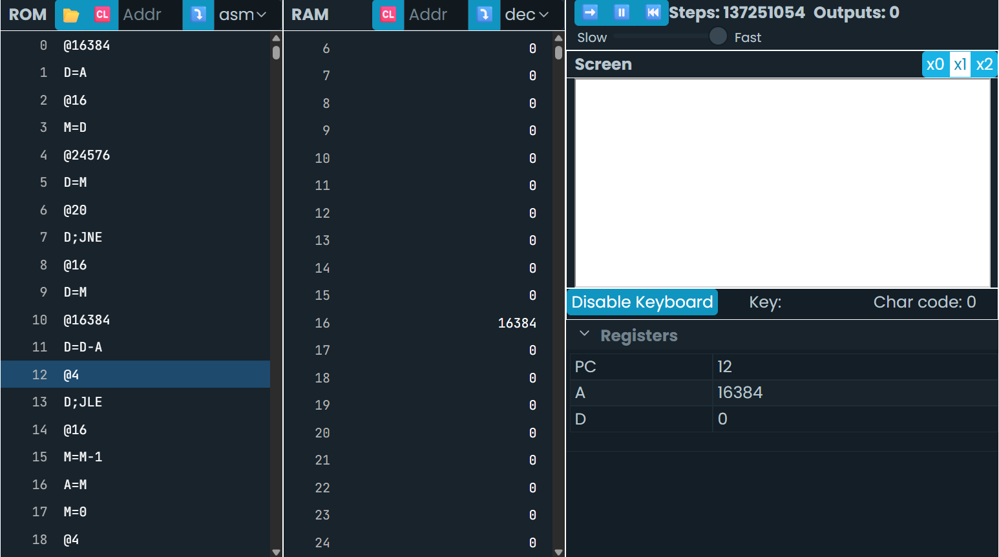
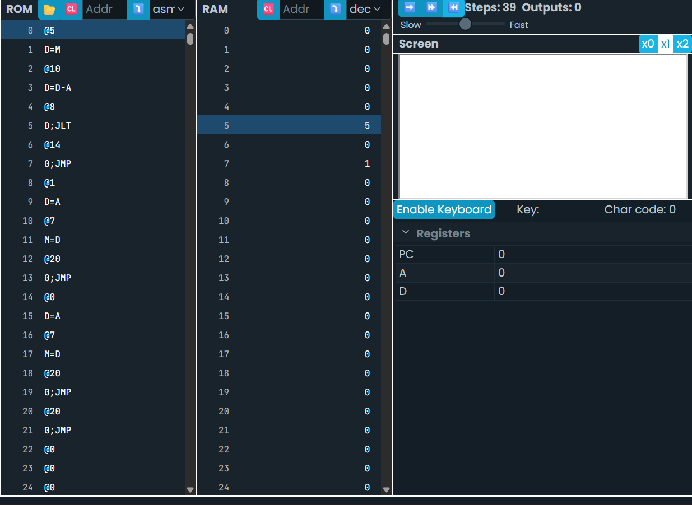

```asm
@SCREEN
D=A
@i
M=D

(READKEYBOARD)
@KBD
D=M
@KEYPRESSED
D;JNE
@i
D=M
@SCREEN
D=D-A
@READKEYBOARD
D;JLE
@i
M=M-1
A=M
M=0
@READKEYBOARD
0;JMP

(KEYPRESSED)
@i
D=M
@KBD
D=D-A
@READKEYBOARD
D;JGE
@i
A=M
M=-1
@i
M=M+1
@READKEYBOARD
0;JMP
```



Lo que hace este codigo es hacer que A apunte a la posicion 16384 (El inicio de los registros de la  pnatalla), despues hace que el valor A se almacene en D, acto seguido declara una variable (@i) y por ultimo el valor almacenado en D se almacena en la variable @i

Identifica una instrucción que use la ALU y explica qué hace: >En este programa la instruccion "M=M+1" es una instruccion ALU debido a que realiza una operacion aritmetica en este caso una suma.

¿Para qué sirve el registro PC?: >Es un registro interno de la CPU la cual se encarga de guaradar la direccion de memoria de la proxima instruccion que el proceso debe ejecutar.

¿Cuál es la diferencia entre @i y @READKEYBOARD?: >La "@i" es una variable declarada en el programa mientras que "@READKEYBOARD" es un a etioqueta que se encraga de leer una tecla presionad en el teclado.

Describe qué se necesita para leer el teclado y mostrar información en la pantalla: >Se necesita de "(READKEYBOARD)" y "@KBD" las cuales se encargan de leer la tecla presionada  por la persona y despues una condicion que en este caso es "KEYPRESSED" que al momento de ser presionada nos lleva al condicional con el mismo nombre en el cual lee el valor del codigo ASCII y lo almacena en la memoria de la pantalla.

Identifica un bucle en el programa y explica su funcionamiento: >"@READKEYBOARD" "0;JMP" es un bucle que se encarga de tener el programa en funcionamiento asi el programa no este haciendo nada.


Escribe un programa que compare el valor almacenado en la dirección de memoria 5 con el valor 10. Si el valor es menor que 10, guarda el valor 1 en la dirección 7. Si el valor es mayor o igual a 10, guarda el valor 0 en la dirección 7.
```ams
@5       
D = M     
@10       
D = D - A 
@LESS     
D; JLT
@GREATER_EQUAL 
GREATER_EQUAL
0; JMP
(LESS)
  @1       
  D = A
  @7       
  M = D    
  @END    
  0; JMP
(GREATER_EQUAL)
  @0      
  D = A
  @7 
  M = D  
  @END
  0; JMP
(END)
  @END
  0; JMP
```


