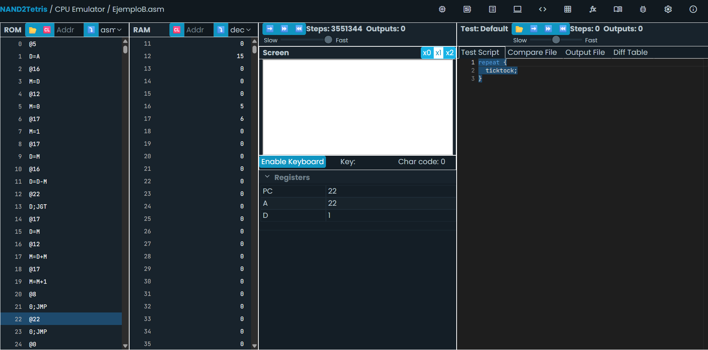
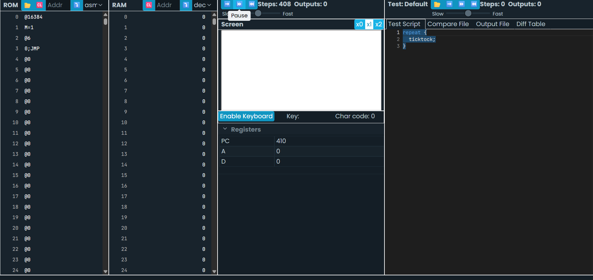
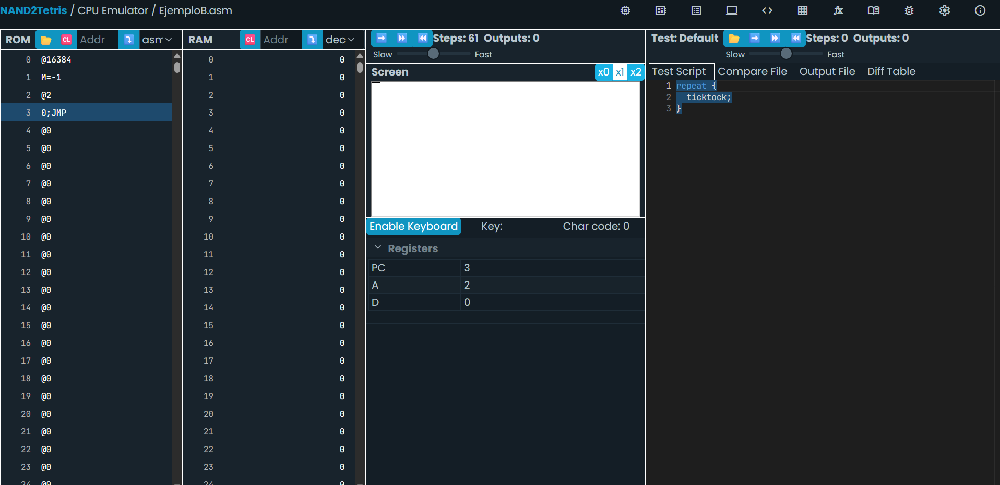

“Crea un programa que use un ciclo para sumar los números del 1 al 5 y guarde el resultado en la dirección de memoria 12.”

```asm
@12
M=0
@1
D=A
@i
M=D
(LOOP)
@i
D=M
@5
D=D-A
@END
D;JGT
@i
D=M
@12
M=D+M
@i
M=M+1
@LOOP
0;JMP
(END)
@END
0;JMP
```


La pantalla del computador Hack se controla a través de un mapa de memoria que comienza en la dirección 16384 (SCREEN). Cada bit en este mapa de memoria representa un pixel en la pantalla (1 = negro, 0 = blanco). Escribe un programa que dibuje un punto negro en la esquina superior izquierda de la pantalla. (Recuerda que la esquina superior izquierda corresponde al primer bit del primer word en la dirección SCREEN).

```asm
@16384
M=1
@6
0;JMP
```


Modifica el programa anterior para que dibuje una línea horizontal negra de 16 pixeles de largo en la esquina superior izquierda de la pantalla. (Recuerda que cada word en la memoria representa 16 pixeles).

```asm
@SCREEN
M=-1
(LOOP)
@LOOP
0;JMP
```

