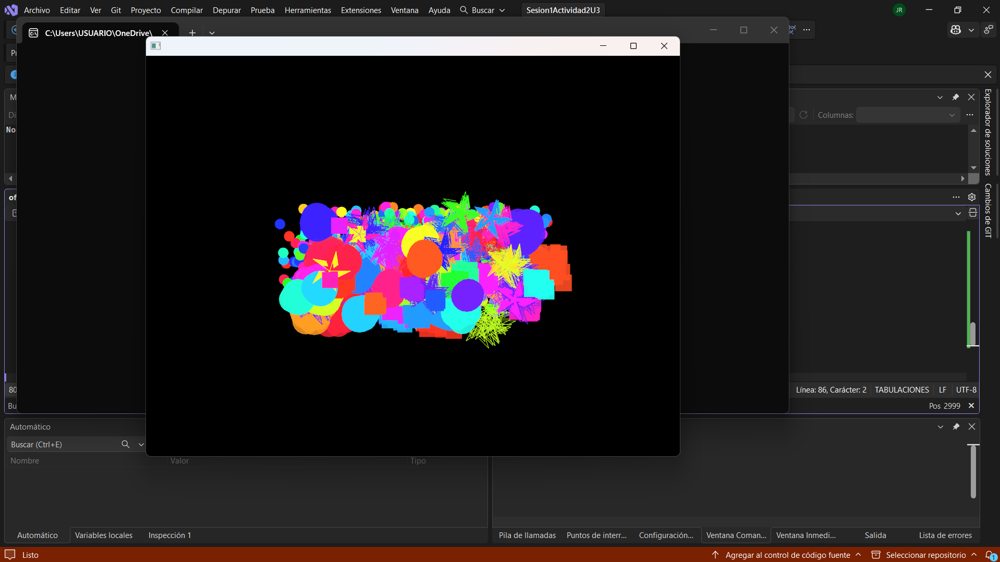

### **Encapsulamiento:**

Señala una línea de código que sea un ejemplo claro de encapsulamiento y explica por qué lo es.

- R=// (private string nombre;) El encapsulamiento consiste en dar a la variable un apropiedad de privacidad (pueden ser Private, Public o Protectec).

¿Por qué crees que el campo nombre es private pero la propiedad Nombre es public? ¿Qué problema se evita con esto?

- R=//

### **Herencia:**

¿Cómo se evidencia la herencia en la clase Circulo?

- R=// Se evidencia a la hora que se declara la variable al final se le ponen dos puntos (:) lo cual que signica que la variable circulo es hijo de la clase Figura.

Un objeto de tipo Circulo, además de Radio, ¿Qué otros datos almacena en su interior gracias a la herencia?

- R=// Tambien almacena el dato de nombre.

### **Polimorfismo:**

Observa el bucle `foreach`. La variable `fig` es de tipo Figura, pero a veces contiene un Circulo y otras un Rectangulo. Cuando se llama a `fig.Dibujar()`, el programa ejecuta la versión correcta. En tu opinión, ¿Cómo crees que funciona esto “por debajo”? No necesitas saber la respuesta correcta, solo quiero que intentes razonar cómo podría ser.

- R=// Para mi el programa implementa un patron con el que se encarga de recorrer la lista e ir creando las figuras segun el patron lo valla solicitando.

### **Parte 3: hipótesis sobre la implementación**

Esta es la parte más importante. Imagina que eres un diseñador de lenguajes de programación. Tienes que decidir cómo implementar estos conceptos en la memoria y en el procesador. No hay respuestas incorrectas, solo ideas. Dibuja si te ayuda.

**Memoria y herencia**: cuando creas un objeto `Rectangulo`, este tiene Base, Altura y también Nombre. ¿Cómo te imaginas que se organizan esos tres datos en la memoria del computador para formar un solo objeto?

- R=// El computador recorre las clases con get set para ir recollectando los datos que conforman el rectangulo asi poder crearlo

**El mecanismo del polimorfismo**: pensemos de nuevo en la llamada fig.Dibujar(). El compilador solo sabe que fig es una Figura. ¿Cómo decide el programa, mientras se está ejecutando, si debe llamar al Dibujar del Circulo o al del Rectangulo? Lanza algunas ideas o hipótesis.

- R=// Idea ingenua: el compilador ve new Circulo(5.0) y guarda esa información "dentro" de la variable fig, para luego llamar al método correcto.

**La barrera del encapsulamiento**: ¿Cómo crees que el compilador logra que no puedas acceder a un miembro private desde fuera de la clase? ¿Es algo que se revisa cuando escribes el código, o es una protección que existe mientras el programa se ejecuta? ¿Por qué piensas eso?

- R=// No logra acceder debido al encapsulamiento ya que mientras sea private solo se puede acceder a ellas mediante metodos de la misma clase.

### **Actividad 2: Aplicación**

**Analiza el código de la aplicación y trata de explicar en tus propias palabras qué está haciendo**

-  El codigo lo que hace es recolectar los valores almacenados en las diferentes clases para que mediante unos comandos establecidos en el coigo sueda una explosion de fiuguras contenidas dentro de las clases ```class Particle``` ```class ExplosionParticle : public Particle``` y ```class StarExplosion : public ExplosionParticle``` los cuales son guiados por una clase que les da el factor random para que cada explosion sea diferente.




