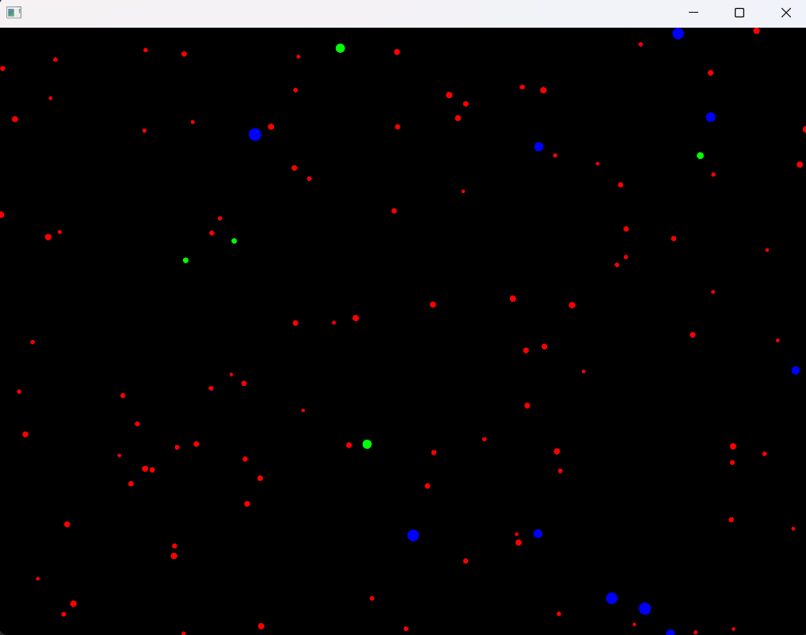
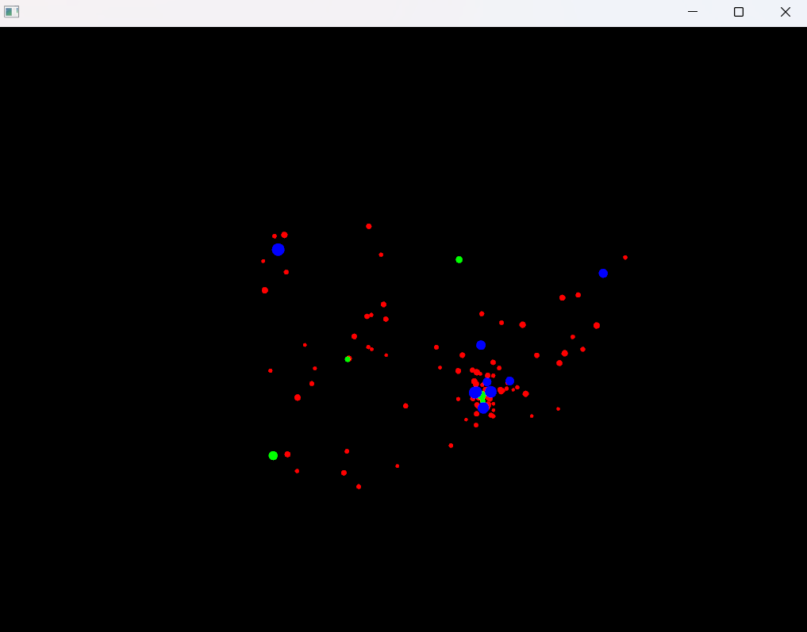
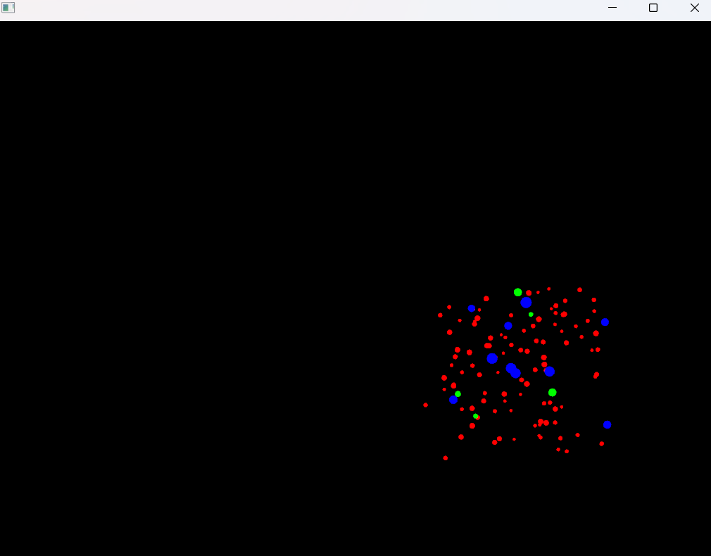
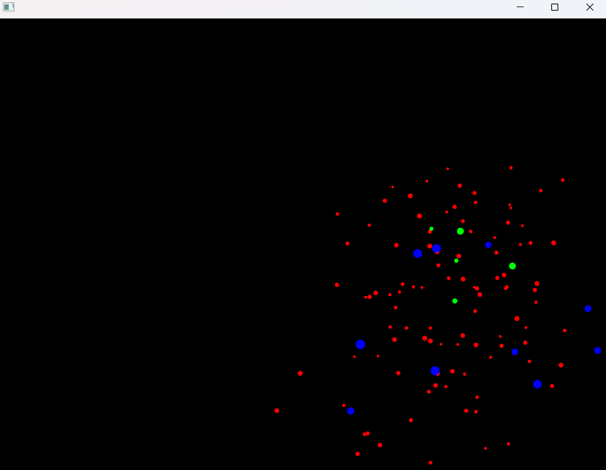

## **Actividad 8: Enunciado**
**¿Cómo puedes interactuar con la aplicación? Menciona específicamente las teclas y qué efecto parecen tener sobre las partículas.**

- R= Dentro del programa podemos interactuar con diferentes letras como lo son "S" la cual hace que las praticulas no se muevan, la tecla "A" hace que las particulas sean atraidas hacía la posicion donde esta el mouse y lo siga a donde se mueva, la "R" hace que dejen de seguir el mouse y las dispersa por la pantalla y la 
"N" hace que vuelvan a su funcionamiento normal.

**¿Observas los diferentes tipos de “partículas”? ¿Se comportan todas igual inicialmente?**

- R= Al iniciar el programa por primera vez las particulas verdes se mueven mas rapiso que las azules y las rojas pero al usar el comando "Normal" todas se vuelven de la misma velocidad

**Toma algunas capturas de pantalla de la aplicación en diferentes momentos (estado inicial, después de presionar ‘a’, ‘r’, ‘s’, ‘n’) y añádelas a tu bitácora.**

**¿Qué crees que está pasando “detrás de cámaras” cuando presionas las teclas? Formula una hipótesis inicial sobre cómo la aplicación cambia el comportamiento de las partículas.**

- Dentro del programa cada uno de los comportamientos que tienen las particulas tiene su respectiva clase programa para que realize en comportamiento asisgnado y las teclas son asisgnadas mediante un swich en el main y cada vez que se presione la tecla asignada se presione llama a la clase.
