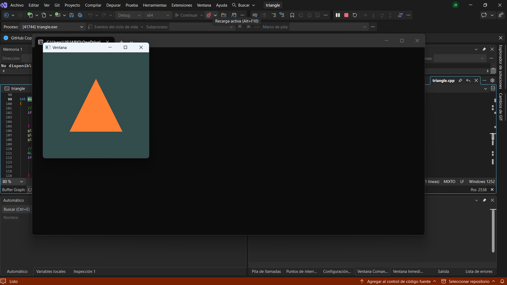

## **Reporta en tu bitácora**
**1. Incluye una captura de pantalla del ejemplo:**
funcionando en tu máquina.

**3. ¿Qué preguntas te surgen al ver el código? Anota al menos tres preguntas que te gustaría investigar más adelante (no te preocupes que la idea de esta unidad es que las resuelvas):**

- ¿Como funciona el codigo de los shaders?
- ¿Que son y para que sirven los IDs globales?
- ¿Que es framebuffer?